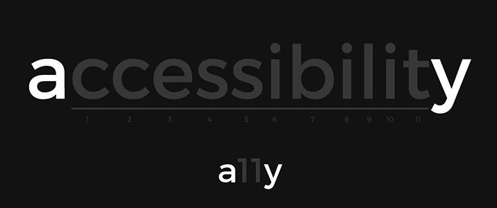

  

  

###

<h1 align='center'> A11y Series - a introduction to Web Accessibility </h1>
  

## 🕰️ A bit of history 

Click to read

In 2018, an e-commerce client of the company I was working at the time received a formal complaint from the US Department that handles the **ADA Law** - responsible for Disability rights in the US.

When this happens, usually the website is given a time-frame to make their site in compliance with Accessibility Guidelines, which was this case.

A specialized company was hired - **it's ALWAYS recommended to have a specialized audit company for this scenario** - to produce a detailed report containing all aspects of the website that were not in compliance.

As I had some previous experience with accessibility and always had high focus on the UX, I was tasked to be the main developer responsible to work close with the audit company and implement all needed changes to make the site in compliance with the Guidelines (at the time, it was ***WCAG 2.0 level AA***)

> The project was a success, and for me it was an amazing opportunity to dig deeper into A11y and learned a lot from the audit company!

After working with it for months,  I decided to write an internal **Accessibility Guide**, not only to share the knowledge with the team, but also to advocate for a web more accessible, which on many cases, doesn't really require much extra effort.

---

## ✅ The series

To make it easier to create and maintain (let's be honest, very long Markdowns aren't great to create), I decided to publish it on [**Notion**](https://www.notion.so/), as their editor offers very good formatting elements / options, **Dark/Light mode** (use `Control + Shift + L` to switch!) and if authenticated, **readers can comment** to contribute, point some mistake, etc!

The original guide had several pages when I wrote, but for the series I decided to restructure it and compile on 3 pages, revising links, texts, information, etc. Hope this serves someone on their journey to accessibility.
## 

### 🔗 Pages
- ☑️ [A11y - making the web more accessible](https://flep.notion.site/A11y-making-the-web-more-accessible-0b06369516b843049854e6bf76ab5041) - Introduction to A11y, what it means, what is WCAG, etc.
- ☑️ [A11y - hands-on guide for developers](https://flep.notion.site/A11y-hands-on-guide-for-developers-700e048775174e3d949875243d08ceed) - Long list of topics with tips, tricks and code examples to help developers with the most common challenges regarding a11y.
- ☑️ [A11y - tools, checklists and resources](https://flep.notion.site/A11y-tools-checklists-and-resources-38fb2aad4245401292f7d7205c50c967) - Browser extensions, screen readers and lots of resources and links.
